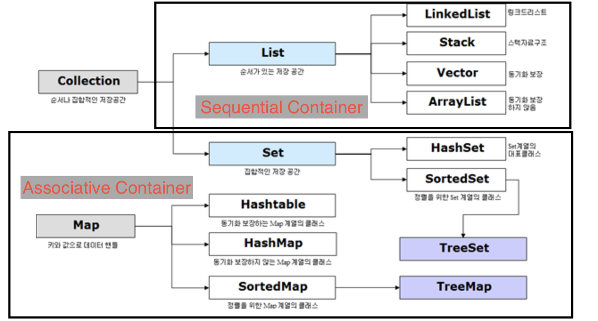

# KEY 찾기 by hashtable, linked list

문제 : <[Samsung SW Expert] 8272. key 조사> <br/>
<https://swexpertacademy.com/main/code/problem/problemDetail.do?contestProbId=AV15QRX6APsCFAYD>

## Contents

- [KEY 찾기 by hashtable, linked list](#key-%ec%b0%be%ea%b8%b0-by-hashtable-linked-list)
  - [Contents](#contents)
  - [Linked list](#linked-list)
  - [Hash](#hash)

## Linked list

- 1.1 Linked list class by 동적할당
  > pop(), push(), size()등의 구현도 아래 코드를 응용하면 충분히 가능하므로 생략.

```C++
typedef struct node
{
    int data;
    struct node *next;
} Node;

class linked_list
{
private:
    Node *head, *tail;

public:
    linked_list()
    {
        head = NULL;
        tail = NULL;
    }

    void add_node(int key)
    {
        // 동적할당!
        Node *tmp = new Node;
        tmp->data = key;
        tmp->next = NULL;

        if (head == NULL)   // 처음 데이터를 저장할 때
        {
            head = tmp;
            tail = tmp;
        }
        else
        {
            tail->next = tmp;
            tail = tail->next;
        }
    }
    bool isExist(int key)   // 해당 데이터가 존재하는지 여부
    {
        Node *cur;
        cur = head;
        while (cur != NULL)
        {
            if (cur->data == key)
                return true;
            else
            {
                cur = cur->next;
            }
        }

        return false;
    }
    void clear()    // Linked list 삭제하기
    {
        Node *tmp;
        while (head != NULL)
        {
            tmp = head;
            head = head->next;
            delete tmp;
        }
        tail = NULL;
    }
};
```

## Hash

- 2.1 Hash Collision


Open Addressing은 데이터를 삽입하려는 해시 버킷이 이미 사용 중인 경우 다른 해시 버킷에 해당 데이터를 삽입하는 방식이다. 데이터를 저장/조회할 해시 버킷을 찾을 때에는 Linear Probing, Quadratic Probing 등의 방법을 사용한다.

Separate Chaining에서 각 배열의 인자는 인덱스가 같은 해시 버킷을 연결한 링크드 리스트의 첫 부분(head)이다.
Open Addressing은 연속된 공간에 데이터를 저장하기 때문에 Separate Chaining에 비하여 캐시 효율이 높다. 따라서 데이터 개수가 충분히 적다면 Open Addressing이 Separate Chaining보다 더 성능이 좋다. 하지만 배열의 크기가 커질수록(M 값이 커질수록) 캐시 효율이라는 Open Addressing의 장점은 사라진다

Java HashMap에서 사용하는 방식은 Separate Channing이다. Open Addressing은 데이터를 삭제할 때 처리가 효율적이기 어려운데, HashMap에서 remove() 메서드는 매우 빈번하게 호출될 수 있기 때문이다. 게다가 HashMap에 저장된 키-값 쌍 개수가 일정 개수 이상으로 많아지면, 일반적으로 Open Addressing은 Separate Chaining보다 느리다. Open Addressing의 경우 해시 버킷을 채운 밀도가 높아질수록 Worst Case 발생 빈도가 더 높아지기 때문이다. 반면 Separate Chaining 방식의 경우 해시 충돌이 잘 발생하지 않도록 '조정'할 수 있다면 Worst Case 또는 Worst Case에 가까운 일이 발생하는 것을 줄일 수 있다
출처: <https://d2.naver.com/helloworld/831311>

- 2.2 Hash map vs Hash table



2.2.1 map과 set(table)

In Computing Science terminology, a map is an associative container mapping from a key to a value. In other words, you can do operations like "for key K remember value V" and later "for key K get the value". A map can be implemented in many ways - for example, with a (optionally balanced) binary tree, or a hash table, or even a contiguous array of structs storing the key/value.

A hash table is a structure for storing arbitrary data, and that data does not necessarily consist of a separate key and value. For example, I could have a hash table containing the values { 1, 10, 33, 97 }, which would be their own keys. When there is no value distinct from the key, this is sometimes known as a "set", and with a hash table implementation a "hash set".

So, a hash table stores elements, each of which need not consist of distinct key and value components, but if it does then it's also a hash map.

2.2.2 동기화 (Synchronization) 여부

HashMap : 동기화를 지원하지 않는다 (thread-not-safe)
Hashtable : 동기화를 지원한다. (thread-safe)
즉, HashMap은 멀티쓰레드 환경에서 사용하지 않는 걸 권장한다. 단일 쓰레드 환경에서 Hashtable 을 쓰더라도 별 문제는 없는데, HashTable 은 동기화 처리라는 비용때문에 HashMap에 비해 더 느리기 때문.

출처: <https://jaybdev.net/2017/06/10/Algorithm-7/>, <https://stackoverflow.com/questions/32274953/difference-between-hashmap-and-hashtable-purely-in-data-structures>

- 2.3 Easy code
  > 해당 키는 이 문제에 특화된 해쉬키이므로 일반적인 hashtable 구현과는 상이할 수 있다. 또한 이 문제에서는 사실 key값은 존재하지 않고 value 만 존재하므로 hashtable이라 명할 수 있고, key값과 value값이 따로따로 있는 경우 hashmap이라 명하여 그에 상응한 코드를 작성해야한다. key 값을 주로 문자열로 되어 있으므로 문자열을 hash function으로 해쉬화 해줘야 한다.

```C++
int checkKey(int key)
{
    int hash_key = key % HASHSIZE;  // easy hash function

    if (!hash_memory[hash_key].isExist(key))
    {
        hash_memory[hash_key].add_node(key);
        return 1;
    }
    else
    {
        return 0;
    }
}
```
